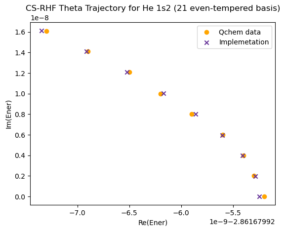
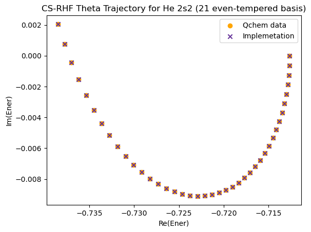
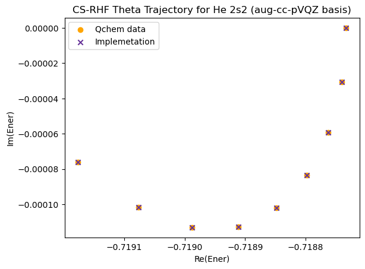
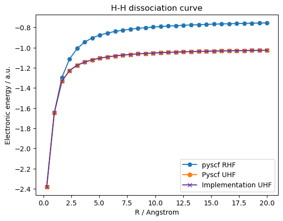
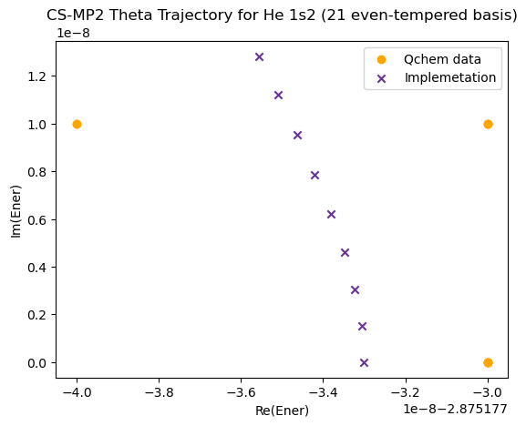
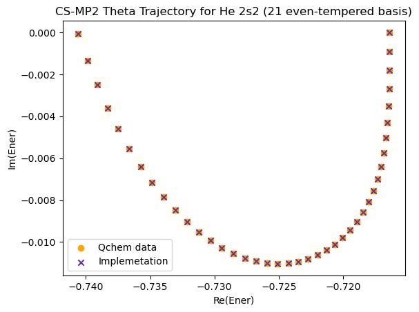
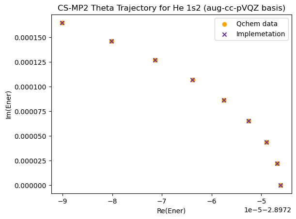
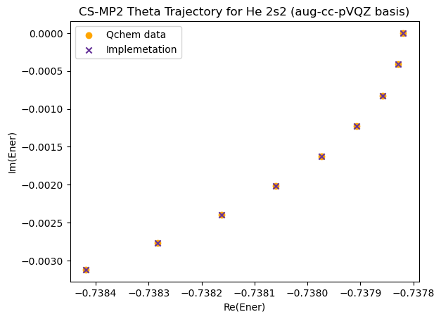

# Results 
This document will serve as a collection of the obtained results regarding complex scaling with the current implementation. 

# (CS)RHF
## Excited state determinants 
The convergence to excited state determinants with the current mask implementation has been compared with calculations performed in both DIRAC and Qchem in the same context and basis, obtaining identical results. 

It has been considered that in other cases it may be necessary to apply the maximum overlap definition to ensure convergence to the desired state. 

## Results compared with Zdanska
In the implemented excited-RHF, the configuration using an even-tempered basis consisting of $29s$ basis functions resulted in an energy of:

$$
E_{2s^{2}}^{RHF/29s}=-0.7127
$$

However using a regular aug-cc-pVQZ results in an energy of:

$$
E_{2s^{2}}^{RHF/aug-cc-pVQZ} = -0.7187
$$

Only a $0.0009$ a.u. of difference with the reference ([[Zdanska; Hartree-Fock orbtials for CS CI.pdf|Zdanska]]):

$$
E_{2s^{2}}^{ZDANSKA} = −0.7196
$$

With an ever larger $aug-cc-pV(5+d)Z$ basis, we get closer to the reference:

$$
E_{2s^{2}}^{RHF/aug-cc-pV(5+d)Z} = -0.7191
$$

We see that increasing the basis leads to smaller widths of the resonance lifetime. This is expected for Fleschbach resonances in the HF methodology ([Zdanska](https://doi.org/10.1063/1.2110169)).  In particular, trying with different basis, the summary of theta-trajectories in the $0 \le \theta \le 0.3$ is:

| Basis             | Number of basis | Energy at $\theta = 0$ | Range of $Re(E)$      | Range of $Im(E)$      |
| ----------------- | --------------- | ---------------------- | --------------------- | --------------------- |
| $29s$             | $29$            | $-0.7127$              | $(0,-2\cdot 10^{-2})$ | $(0,-9\cdot 10^{-3})$ |
| $aug-cc-pVQZ$     | $46$            | $-0.7187$              | $(0,-8\cdot 10^{-4})$ | $(0,-4\cdot 10^{-3})$ |
| $aug-cc-pV(5+d)Z$ | $80$            | $-0.7191$              | $(0,-3\cdot 10^{-4})$ | $(0,-2\cdot 10^{-4})$ |

We can see that in the larger basis limit, the energy change with theta decreases and the lifetime tends to $0$.

## (CS)RHF Results compared with Qchem
The following theta trajectories were calculated and compared with the results from Qchem (using the same basis and scaling):

### Even tempered basis

### Aug-cc-pVQZ basis

### Qchem comparison:
It is possible to see that the current implementation matches the reference up to $10^{-9}$ in all cases, the significant figure precision given in the Qchem output. For more details of these calculations see [CSRHF Qchem Notebook](../notebooks/CS-SCF%20results/2_Qchem_CSRHF_results.ipynb).

# (CS)UHF
## Results
In order to test the UHF implementation, various dissociation curves were tested. In general, agreement with PySCF was achieved within numerical precision (except when PySCF could not converge). These tests are collected in the [UHF tests notebook](../notebooks/CS-SCF%20results/3_UHF_examples.ipynb). 

An example is the hydrogen dissiociation curve:

# (CS)MP2

## RMP2 In noble gases 
Right now **using the obtained MO coefficients of the implementation**, the RMP2 energy error for `aug-cc-pvtz` are:

|Atom| $MP2$ Energy Error |
|----|---------------------|
|$He$| $2.2 \cdot 10^{-15}$ |
|$Mg$| $8.5 \cdot 10^{-14}$ |
|$Ne$| $8.5 \cdot 10^{-14}$ |
|$Ar$| $2.3 \cdot 10^{-13}$ |
|$Kr$| $8.2 \cdot 10^{-12}$ |

Within numerical precision. Some issues appeared in the beggining, but it was just a convergence issue in the RHF step. PySCF's wave function converged with a smaller tolerance than the current implementation, leading to small differences in the MO coefficients that resulted in significant error in the MP2 energy. After tightening the RHF convergence, these errors disappeared.

## (CS)RMP2 results compared with Qchem
The following theta trajectories were calculated and compared with the results from Qchem (using the same basis and scaling):

### Even tempered basis

 
 

### Aug-cc-pVQZ basis

 
 

### Qchem comparison:
It is possible to see that the current implementation matches the reference up to $10^{-9}$ in all cases, the significant figure precision given in the Qchem output. For more details of these calculations see [CSRHF Qchem Notebook](../notebooks/CS-MP2%20results/4_2_Qchem_MP2.ipynb).

# References 
- [Zdanska, S., & Domcke, W. (2003). Hartree-Fock orbitals for complex-scaled configuration interaction calculations of resonance energies and widths. The Journal of Chemical Physics, 119(14), 7067-7075](https://doi.org/10.1063/1.2110169).
- [Basis set exchange](https://www.basissetexchange.org/).
- [PySCF](https://doi.org/10.1063/5.0006074).
- [Qchem](https://doi.org/10.1080/00268976.2014.952696).
- [Dirac](https://doi.org/10.1063/5.0004844).